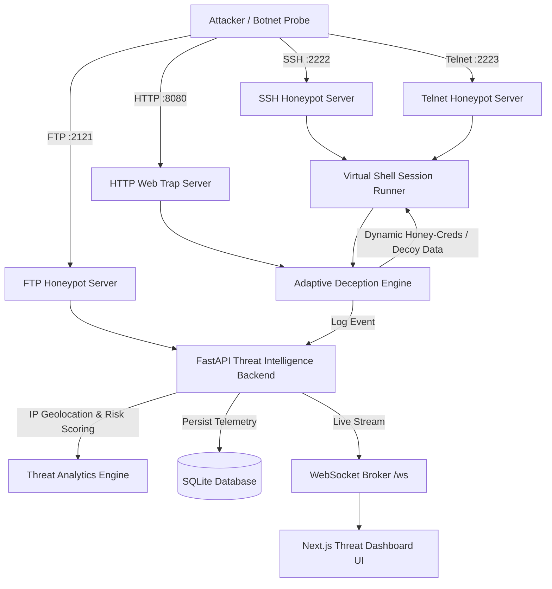
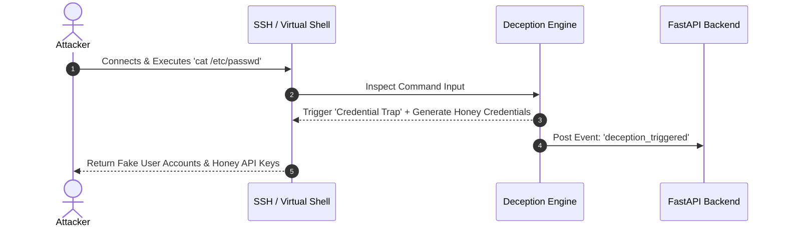

<div align="center">

# 🛡️ SentinelTrap: Multi-Layer Honeypot Framework
### Academic & Technical Project Documentation for Faculty Evaluation

[](https://www.python.org/)
[](https://fastapi.tiangolo.com/)
[](https://nextjs.org/)
[](https://tailwindcss.com/)
[](https://www.sqlite.org/)
[](https://www.docker.com/)

---

</div>

> [!NOTE]
> **Project Scope**: Active Cyber Deception • Multi-Protocol Traps (SSH/Telnet/HTTP/FTP) • Threat Risk Scoring (0–100) • Automated Incident PDF Reporting • Live Dashboard Telemetry

---

## 📌 1. Abstract & Motivation

Traditional network security defenses rely heavily on passive blocking mechanisms like firewalls and signature-based Intrusion Detection Systems (IDS). However, modern cyber adversaries frequently bypass static rules using novel zero-day techniques and living-off-the-land commands.

**SentinelTrap** shifts the defense paradigm from passive blocking to **Active Cyber Deception**. By deploying realistic, multi-protocol decoy nodes across SSH, Telnet, HTTP, and FTP, SentinelTrap attracts adversaries into zero-risk isolated environments. An integrated **Adaptive Deception Engine** monitors keystrokes and shell commands in real time, dynamically generating honey credentials, fake database nodes, and decoy routing tables. All captured telemetry is enriched with IP Geolocation metadata, scored for threat severity, and streamed live to a security operations dashboard.

---

## 🏗️ 2. System Architecture & Data Flow



---

## ⚡ 3. Multi-Protocol Honeypot Suite

| Protocol Node | Default Port | Target Threat Vector | Captured Activity & Deception |
| :--- | :--- | :--- | :--- |
| **SSH Node** | `2222` | Credential Brute-Force & Remote Shell | Stateful bash simulation, keystroke logging, honey `/etc/passwd` injection |
| **Telnet Node** | `2223` | IoT Botnet Probes (e.g. Mirai) | Telnet byte negotiation, raw login capture, automated scan tracking |
| **HTTP Web Trap** | `8080` | Web Scanners & Exploits | Captures `/admin`, `/.env`, SQL injections, serves fake corporate login forms |
| **FTP Node** | `2121` | Anonymous Login & File Uploads | Log anonymous auth attempts, directory listing (`LIST`), payload upload capture (`STOR`) |

---

## 🎭 4. Adaptive Deception Mechanics

> [!IMPORTANT]
> **Active Engagement**: The honeypot does not immediately terminate attacker sessions. Instead, it dynamically generates context-aware honey responses to extend session duration and study attacker TTPs.



1. **Credential Harvesting Trap**: When an attacker executes `cat /etc/passwd`, `grep password`, or `shadow`, the engine generates fake user accounts (`admin`, `db_backup_user`) and honey API keys.
2. **Database Access Trap**: When commands like `mysql`, `psql`, or `mongo` are entered, the engine returns realistic database connection error codes (`Error 1045 Access Denied`) and logs vulnerability alert dispatches.
3. **Network Reconnaissance Trap**: Commands like `nmap`, `ifconfig`, or `netstat` trigger simulated routing tables disclosing dummy internal IP addresses (`10.0.4.18` Decoy DB).

---

## 📊 5. Threat Intelligence & Risk Scoring Algorithm

SentinelTrap implements an automated **Attacker Risk Score (0–100)** to classify threat severity:

$$\text{Risk Score} = \text{Base (10)} + \sum \text{Command Weight}$$

- **Credential Search**: $+30$ points (*Credential Harvester*)
- **Database Probing**: $+25$ points (*DB Exploit Vector*)
- **Network Reconnaissance**: $+20$ points (*Reconnaissance Probe*)
- **System File Inspection**: $+5$ points

> [!TIP]
> **IP Geolocation & ISP Lookup**: Attacker IP addresses are automatically enriched with Country, City, Coordinates, ISP Name, ASN, and Proxy detection flags via `backend/geolocate.py` with `@lru_cache` optimization.

---

## 🗄️ 6. Database Schema Definition

### Table: `sessions`
```sql
CREATE TABLE sessions (
    id VARCHAR PRIMARY KEY,
    ip_address VARCHAR INDEX,
    country VARCHAR DEFAULT 'Unknown',
    city VARCHAR DEFAULT 'Unknown',
    latitude FLOAT,
    longitude FLOAT,
    username_attempted VARCHAR,
    password_attempted VARCHAR,
    started_at DATETIME,
    ended_at DATETIME
);
```

### Table: `events`
```sql
CREATE TABLE events (
    id INTEGER PRIMARY KEY AUTOINCREMENT,
    session_id VARCHAR REFERENCES sessions(id),
    timestamp DATETIME,
    event_type VARCHAR,
    input_data TEXT,
    output_data TEXT
);
```

---

## 🔌 7. REST & WebSocket API Specification

| Method | Endpoint | Description |
| :--- | :--- | :--- |
| `POST` | `/api/sessions` | Register session & perform enriched IP Geolocation |
| `PATCH` | `/api/sessions/{id}` | Update session termination timestamp |
| `POST` | `/api/sessions/{id}/events` | Log command execution or deception trigger |
| `GET` | `/api/sessions` | Retrieve all captured attacker sessions |
| `GET` | `/api/sessions/{id}/events` | Fetch event log timeline for session terminal replay |
| `GET` | `/api/threat-intel/ip/{ip}` | Get full IP threat profile, ISP/ASN metadata, & Risk Score |
| `GET` | `/api/stats/overview` | Summary counts of sessions, events, top credentials, & commands |
| `GET` | `/api/reports/export` | Download full telemetry export in **CSV** or **JSON** format |
| `GET` | `/api/reports/pdf/{session_id}` | Auto-generate & download PDF Incident Report |
| `WS` | `/ws` | Real-time WebSocket event streaming channel |

---

## 👥 8. Team Structure & Contributions

| Priority | Team Member | Academic & Technical Role | Submodules & Responsibilities |
| :---: | :--- | :--- | :--- |
| 🥇 **1** | **Abhinav Mishra** | **Project Lead & Core Architect** | Overall Framework Architecture, Adaptive Deception Engine (`deception.py`), FastAPI Threat Backend (`main.py`, `analytics.py`, `geolocate.py`), System Integration & Docker Orchestration |
| 🥈 **2** | **Jaiyansh Dhaulakhandi** | **Senior Backend & Honeypot Engineer** | Multi-Protocol Honeypot Nodes: SSH Server (`server.py`), Telnet Server (`telnet_server.py`), HTTP Web Trap (`web_trap.py`), FTP Server (`ftp_server.py`), and Virtual Shell Runner (`shell.py`) |
| 🥉 **3** | **Shivani Saxena** | **Frontend Core Developer** | Next.js App Router core setup, root layout, live WebSocket connection status indicator, total session summary metrics, and Attacker Sessions sidebar |
| 🥉 **4** | **Khushi Wankhede** | **Frontend Streaming Developer** | Real-time command stream component (`LiveFeed.tsx`) & interactive terminal bash session replay player (`TerminalReplay.tsx`) |
| 🥉 **5** | **Anushka Mudgal** | **Frontend Analytics & Reports** | Recharts threat data analytics (`Analytics.tsx`) & PDF/CSV/JSON export control panel (`ExportPanel.tsx`) |

---

## 🛠️ 9. Deployment & Demonstration Steps

> [!WARNING]
> Ensure port `2222` (SSH), `2223` (Telnet), `8080` (Web), and `2121` (FTP) are not blocked by local host firewalls during live demonstration.

1. **Launch Containers**:
   ```bash
   docker-compose up --build
   ```
2. **Execute SSH Honeypot Connection**:
   ```bash
   ssh root@localhost -p 2222
   ```
3. **Trigger Deception Mechanics**:
   - `cat /etc/passwd`
   - `mysql -u root`
   - `nmap 192.168.1.1`
4. **Inspect Telemetry**: Access OpenAPI interactive documentation at `http://localhost:8000/docs`.
